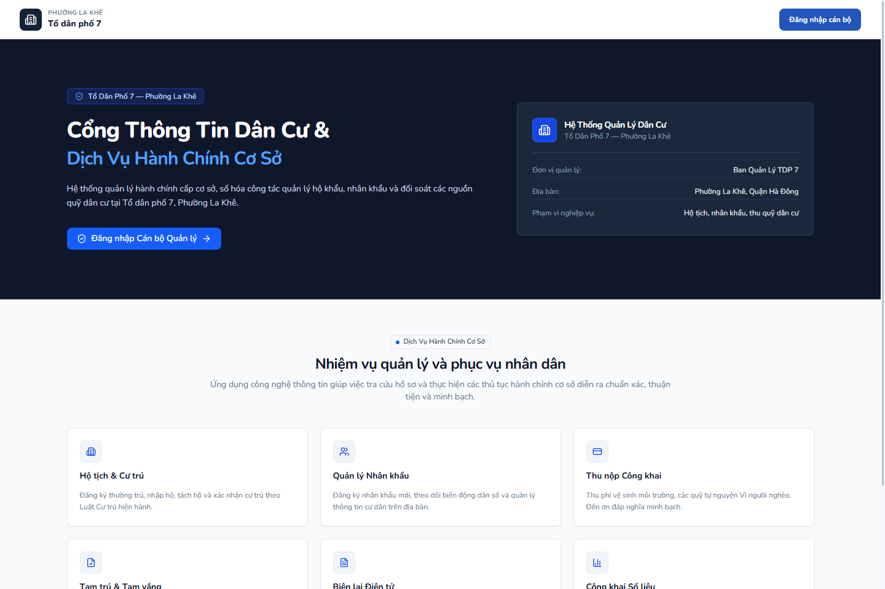
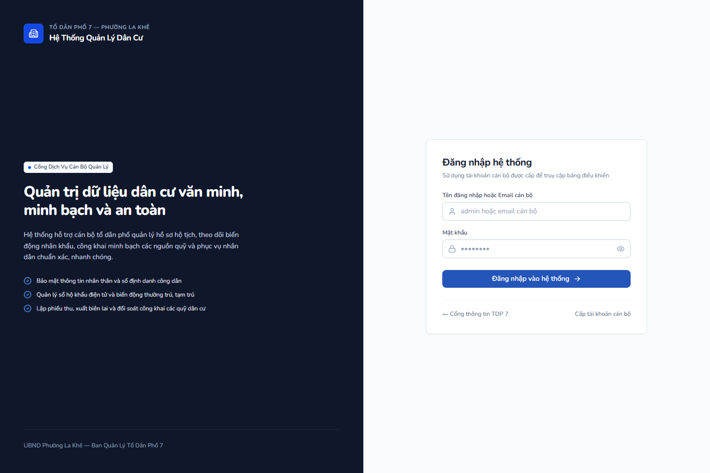
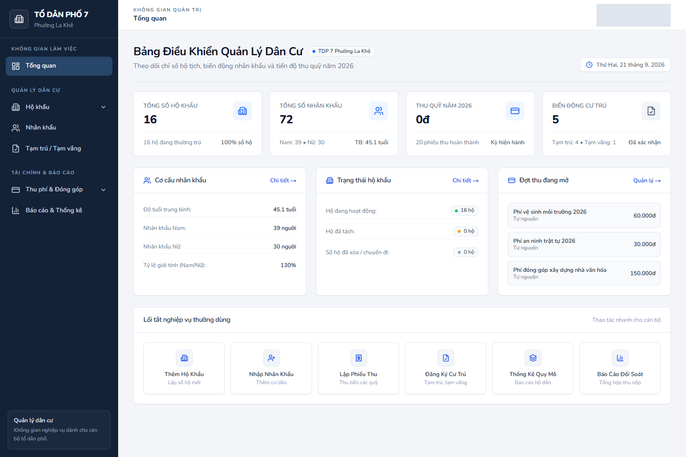
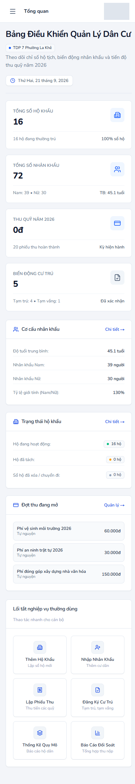
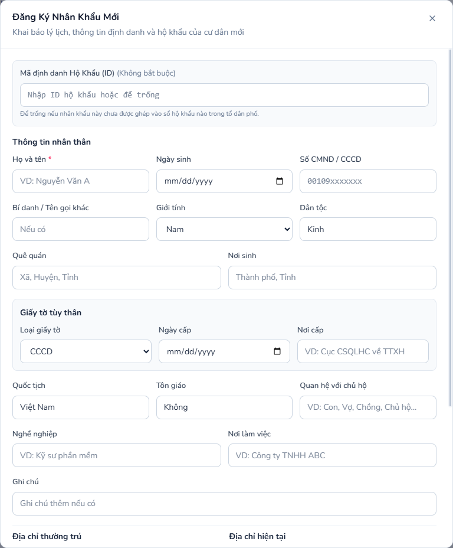

# Hệ thống Quản lý Dân cư — Tổ dân phố 7, Phường La Khê

Ứng dụng web hỗ trợ cán bộ tổ dân phố quản lý **hộ khẩu**, **nhân khẩu**, **tạm trú/tạm vắng**, **khoản thu**, **phiếu thu** và **báo cáo đối soát**. Dự án gồm frontend Next.js và backend NestJS sử dụng MongoDB.

> Dành cho môi trường nội bộ có dữ liệu công dân. Không đưa dữ liệu thật, mật khẩu, cookie phiên, chuỗi kết nối hoặc ảnh có thông tin cá nhân lên kho mã nguồn công khai.

## Mục lục

- [Giao diện](#giao-diện)
- [Chức năng](#chức-năng)
- [Kiến trúc](#kiến-trúc)
- [Công nghệ](#công-nghệ)
- [Điều kiện chạy](#điều-kiện-chạy)
- [Cài đặt và chạy local](#cài-đặt-và-chạy-local)
- [Cấu hình môi trường](#cấu-hình-môi-trường)
- [Hướng dẫn sử dụng](#hướng-dẫn-sử-dụng)
- [Route giao diện và API](#route-giao-diện-và-api)
- [Phân quyền](#phân-quyền)
- [Kiểm thử](#kiểm-thử)
- [Triển khai](#triển-khai)
- [An toàn dữ liệu](#an-toàn-dữ-liệu)
- [Xử lý lỗi thường gặp](#xử-lý-lỗi-thường-gặp)
- [Giới hạn hiện tại](#giới-hạn-hiện-tại)

## Giao diện

### Cổng thông tin công khai



### Đăng nhập cán bộ



### Dashboard quản trị desktop

Ảnh dùng dữ liệu kiểm thử; vùng tài khoản đã được che.



### Dashboard mobile



### Biểu mẫu nhân khẩu



## Chức năng

| Phân hệ | Chức năng chính |
| --- | --- |
| Xác thực | Đăng nhập, đăng xuất, làm mới phiên, xem hồ sơ tài khoản. |
| Hộ khẩu | Cấp sổ mới, xem chi tiết, sửa thông tin, thêm/bớt thành viên, đổi chủ hộ, tách hộ, xem lịch sử biến động và thống kê. |
| Nhân khẩu | Đăng ký nhân khẩu, khai sinh, sửa hồ sơ, tìm kiếm, chuyển đi, ghi nhận qua đời và xem thống kê. |
| Tạm trú / Tạm vắng | Đăng ký, gia hạn/cập nhật, hủy/xóa, tìm kiếm theo họ tên hoặc CCCD, lọc trạng thái và cảnh báo hồ sơ sắp hết hạn. |
| Khoản thu | Quản lý khoản thu bắt buộc và chiến dịch đóng góp tự nguyện. |
| Thu phí | Lập phiếu thu, theo dõi đã thu/chưa thu, tính phí theo hộ, xem lịch sử và biên lai. |
| Báo cáo | Thống kê thu phí, đợt thu, hộ đã nộp/chưa nộp và lịch sử đóng góp của hộ. |
| Quản trị cán bộ | Tạo, sửa, khóa và xóa tài khoản cán bộ theo quyền. |

### Nâng cấp giao diện

- Sidebar điều hướng theo nhóm nghiệp vụ, có drawer cho mobile.
- Workspace dùng bảng, toolbar lọc và tiêu đề trang nhất quán.
- Component dùng chung: `Button`, `Badge`, `Card`, `StatCard`, `DataTable`, `Modal`, `ConfirmDialog`, `PageHeader`.
- Dialog native có Escape, trả focus về nút mở, body cuộn riêng và responsive.
- Bảng phân biệt đang tải, lỗi API, rỗng và không có kết quả lọc; có thể cuộn ngang cục bộ trên màn hình nhỏ.
- Input/select/textarea có nhãn; nút icon có accessible name; focus và reduced motion được xử lý trong CSS dùng chung.

## Kiến trúc

```mermaid
flowchart LR
  Browser[Trình duyệt] -->|HTTPS / JSON| FE[Frontend Next.js<br/>App Router + React Query]
  FE -->|Bearer access token| API[Backend NestJS<br/>/api]
  API --> Auth[Xác thực JWT<br/>và RBAC]
  Auth --> DB[(MongoDB)]
  API --> DB
  API -->|Swagger khi được bật| Docs[/docs]
```

- **Frontend** là ứng dụng Next.js App Router. `Boostrap.tsx` khôi phục phiên, bảo vệ route và chuyển hướng chưa đăng nhập về `/auth/login`.
- **Backend** đặt prefix `/api`, dùng ValidationPipe toàn cục và exception filter để chuẩn hóa lỗi.
- **MongoDB** lưu tài khoản, hộ khẩu, nhân khẩu, đăng ký cư trú, khoản thu và phiếu thu.
- **Xác thực** dùng access token qua header `Authorization: Bearer …`; refresh token được backend giữ trong cookie `httpOnly`.

### Cấu trúc thư mục

```text
Human-Management/
├── backend/
│   ├── src/
│   │   ├── auth/                 # JWT, local auth, guard và phân quyền
│   │   ├── users/                # Tài khoản cán bộ
│   │   ├── ho-khau/              # Hộ khẩu và biến động
│   │   ├── nhan-khau/            # Nhân khẩu, khai sinh, chuyển đi, qua đời
│   │   ├── tam-tru-tam-vang/     # Quản lý cư trú có thời hạn
│   │   ├── khoan-thu/            # Danh mục khoản thu
│   │   ├── thu-phi/              # Phiếu thu và thống kê tài chính
│   │   ├── common/filters/       # Xử lý exception toàn cục
│   │   └── scripts/              # Seed/kiểm tra seed, chỉ dùng môi trường test
│   └── test/                     # E2E test config
├── frontend/
│   └── src/
│       ├── app/                  # Route, API client theo phân hệ, page/modal
│       ├── components/           # Layout, sidebar, navbar và UI dùng chung
│       └── lib/                  # Axios và phiên người dùng
├── docs/images/                  # Ảnh minh họa README đã rà soát riêng tư
├── scripts/                      # Kiểm tra regression/configuration từ root
└── plans/                        # Kế hoạch kỹ thuật và báo cáo kiểm chứng
```

## Công nghệ

| Lớp | Công nghệ |
| --- | --- |
| Frontend | Next.js 15, React 19, TypeScript, Tailwind CSS 4 |
| Client state | TanStack React Query |
| HTTP/UI | Axios, Lucide React, Sonner |
| Backend | NestJS 11, TypeScript, Express |
| Database | MongoDB và Mongoose |
| Bảo mật | Passport Local/JWT, bcryptjs, cookie-parser, class-validator |
| Tài liệu API | Swagger/OpenAPI |
| Kiểm thử | Jest/Supertest phía backend; Node assertion và TypeScript check phía project |

## Điều kiện chạy

- Node.js **20 trở lên**; nên dùng Node 20 hoặc 22 LTS.
- npm.
- MongoDB đang hoạt động, local hoặc dịch vụ được tổ chức phê duyệt.
- Một shell cho backend, một shell cho frontend.

## Cài đặt và chạy local

### 1. Clone và cài dependencies

```bash
git clone https://github.com/duong-vn/Human-Management.git
cd Human-Management

npm --prefix backend install
npm --prefix frontend install
```

Repository không dùng npm workspace gốc; cài package riêng cho `backend/` và `frontend/`.

### 2. Cấu hình môi trường

Tạo file môi trường riêng trên máy theo bảng [Cấu hình môi trường](#cấu-hình-môi-trường). Không commit file môi trường.

### 3. Khởi động backend

```bash
npm --prefix backend run dev
```

Mặc định backend nghe tại `http://localhost:8080`, API tại `http://localhost:8080/api`.

Ở development, Swagger mặc định có tại `http://localhost:8080/docs`.

### 4. Khởi động frontend

Mở shell khác:

```bash
npm --prefix frontend run dev
```

Mặc định frontend có tại `http://localhost:3000`.

> Không chạy `npm --prefix frontend run build` cùng lúc với dev server dùng chung thư mục `frontend/.next`; build có thể làm dev asset 404. Dừng dev server trước khi build, hoặc dùng môi trường/build directory tách riêng.

### 5. Dừng server

Trên Windows, dừng tiến trình đã biết bằng:

```bash
taskkill //PID <pid> //T //F
```

Không dùng lệnh này với PID chưa xác minh.

## Cấu hình môi trường

Chỉ dùng tên biến dưới đây; không ghi secret hoặc URI thật vào README, log hay commit.

### Backend

| Biến | Bắt buộc | Mô tả |
| --- | --- | --- |
| `NODE_ENV` | Có cho production | `development` hoặc `production`. |
| `PORT` | Không | Cổng backend; mặc định `8080`. |
| `MONGODB_URI` | Có | Kết nối MongoDB. Backend dừng ngay nếu thiếu. |
| `JWT_SECRET` | Có cho production | Khóa ký access token. Không dùng fallback development cho production. |
| `REFRESH_TOKEN_SECRET` | Có cho production | Khóa ký refresh token. |
| `CORS_ORIGIN` | Có cho production | Danh sách origin frontend cách nhau bằng dấu phẩy. Development mặc định cho phép; production mặc định chặn nếu thiếu. |
| `ENABLE_SWAGGER` | Không | Đặt `true` để bật Swagger ở production. Development tự bật. |

Backend nạp cấu hình theo thứ tự môi trường hiện tại, `.env`, rồi `.env.local`. Các file này là dữ liệu nhạy cảm, không được commit.

### Frontend

| Biến | Bắt buộc | Mô tả |
| --- | --- | --- |
| `NEXT_PUBLIC_API_BASE_URL` | Không cho local | URL base API. Nếu không đặt, client dùng `http://localhost:8080/api`. |

Vì biến `NEXT_PUBLIC_*` có thể được bundle cho browser, **không** đặt secret vào biến này.

## Hướng dẫn sử dụng

### Đăng nhập và tài khoản

1. Mở `/auth/login`.
2. Nhập tài khoản cán bộ được cấp.
3. Backend cấp access token; frontend tự gắn token cho request API.
4. Khi access token hết hạn, Axios thử refresh phiên từ cookie `httpOnly`.
5. Đăng xuất từ menu tài khoản để xóa phiên refresh phía server.

Trang `/auth/register` hiện chỉ cho biết quy trình cấp tài khoản; cấp tài khoản thực tế thực hiện trong phân hệ **Quản trị cán bộ** bởi người có quyền.

### Hộ khẩu và nhân khẩu

1. Vào **Hộ khẩu** để tạo sổ, nhập địa chỉ/chủ hộ và xem thành viên.
2. Dùng chi tiết sổ để thêm thành viên, tách hộ, đổi chủ hộ hoặc xem lịch sử.
3. Vào **Nhân khẩu** để thêm, sửa, tìm kiếm và cập nhật trạng thái.
4. Dùng **Khai sinh**, **Chuyển đi**, **Qua đời** đúng theo nghiệp vụ. Các thao tác này thay đổi dữ liệu thật.

### Tạm trú / Tạm vắng

1. Chọn **Đăng ký mới**.
2. Chọn hình thức, nhân khẩu, địa chỉ/nơi đến, khoảng thời gian và trạng thái.
3. Dùng bộ lọc **Sắp hết hạn** để xem hồ sơ còn từ 0 đến 15 ngày.
4. Dùng tìm kiếm theo họ tên hoặc số CCCD.

### Thu phí và đóng góp

1. Tạo khoản thu hoặc chiến dịch trước.
2. Ở **Thu phí vệ sinh & định kỳ**, chọn kỳ và khoản thu; số tiền có thể tính theo số nhân khẩu của hộ.
3. **Thu tiền**, **Ghi nợ**, cập nhật phiếu, xóa phiếu và xóa khoản thu đều có thể thay đổi dữ liệu tài chính. Chỉ thực hiện trên môi trường/bộ dữ liệu được phê duyệt.
4. Vào **Báo cáo & Thống kê** để xem đợt thu, hộ đã/chưa nộp và biên lai.

## Route giao diện và API

### Frontend routes

| Route | Mục đích |
| --- | --- |
| `/` | Cổng thông tin khi chưa có phiên; dashboard khi đã đăng nhập. |
| `/auth/login` | Đăng nhập. |
| `/auth/register` | Thông tin cấp tài khoản. |
| `/ho-khau` | Quản lý sổ hộ khẩu. |
| `/ho-khau/thong-ke` | Thống kê hộ khẩu. |
| `/nhan-khau` | Quản lý nhân khẩu. |
| `/tam-tru-tam-vang` | Quản lý tạm trú/tạm vắng. |
| `/thu-phi` | Khoản thu và lịch sử phiếu thu. |
| `/thu-phi/ve-sinh` | Thu phí định kỳ. |
| `/thu-phi/dong-gop` | Chiến dịch đóng góp tự nguyện. |
| `/thong-ke` | Báo cáo thu phí/đối soát. |
| `/user` | Quản trị cán bộ. |

### API groups

Mọi API đặt dưới prefix `/api`. Swagger là nguồn tham chiếu chi tiết khi được bật.

| Prefix | Nội dung |
| --- | --- |
| `/api/auth` | Login, logout, refresh, register, profile. |
| `/api/users` | Quản lý tài khoản cán bộ. |
| `/api/ho-khau` | Hộ khẩu, tách hộ, thành viên, lịch sử và thống kê. |
| `/api/nhan-khau` | Nhân khẩu, tìm kiếm, khai sinh, chuyển đi, qua đời và thống kê. |
| `/api/tam-tru-tam-vang` | Hồ sơ cư trú có thời hạn và thống kê. |
| `/api/khoan-thu` | Danh mục khoản thu bắt buộc/tự nguyện. |
| `/api/thu-phi` | Phiếu thu, thống kê theo năm/khoản/đợt và lịch sử hộ. |

## Phân quyền

Backend dùng JWT guard kết hợp role guard. Quyền thực tế được kiểm tra tại controller/backend; giao diện chỉ điều hướng theo phiên hiện có.

| Vai trò | Phạm vi |
| --- | --- |
| `to_truong` | Toàn quyền; là vai trò bypass kiểm tra role cụ thể của backend. |
| `to_pho` | Nghiệp vụ dân cư và nhiều tác vụ quản trị theo endpoint. |
| `ke_toan` | Khoản thu, phiếu thu và báo cáo tài chính. |
| `can_bo` | Nghiệp vụ dân cư cơ bản theo endpoint được cho phép. |

Không dựa vào việc ẩn nút ở frontend để bảo vệ dữ liệu. API phải luôn kiểm tra token và role.

## Kiểm thử

### Kiểm tra project từ root

```bash
node scripts/verify-admin-ui.mjs
node scripts/verify-further-improvements.mjs
node scripts/verify-performance-strictness.mjs
node frontend/src/app/tam-tru-tam-vang/utils.test.mjs
npm --prefix frontend exec --no -- tsc --project frontend/tsconfig.json --noEmit --incremental false
git diff --check
```

- `verify-admin-ui.mjs`: render component thực, bảng, phân trang, loading/error/empty và semantics dialog.
- `verify-further-improvements.mjs`: guard route, font optimization, filter backend và exception filter.
- `verify-performance-strictness.mjs`: assertion performance/strictness có sẵn.
- `utils.test.mjs`: kiểm tra biên cảnh báo cư trú 0, 5, 15, 16 ngày, ngày quá hạn và dữ liệu không hợp lệ.
- TypeScript: kiểm tra toàn bộ frontend không emit file.

### Backend

```bash
npm --prefix backend run test
npm --prefix backend run test:e2e
```

Các test cần MongoDB và cấu hình phù hợp. Không coi test frontend thay thế kiểm thử mutation/backend.

### Kiểm tra browser thủ công

- Desktop: 1440×900; mobile: 390×844; tablet: 768px.
- Kiểm tra không tràn ngang, sidebar/drawer, keyboard/Escape, form dài, bảng cuộn cục bộ, trạng thái loading/empty/error và route guard.
- Với môi trường có dữ liệu thật, chỉ kiểm tra đọc/xem. Không gửi tạo/sửa/xóa/thu tiền nếu chưa có bộ dữ liệu test được phê duyệt.

## Triển khai

### Backend

```bash
npm --prefix backend run build
npm --prefix backend run start:prod
```

Trước khi deploy production:

1. Đặt `NODE_ENV=production`.
2. Cấu hình `MONGODB_URI`, `JWT_SECRET`, `REFRESH_TOKEN_SECRET` bằng secret manager của hạ tầng.
3. Đặt `CORS_ORIGIN` thành origin frontend cụ thể; không để production mặc định mở CORS.
4. Swagger tắt mặc định ở production. Chỉ đặt `ENABLE_SWAGGER=true` khi có kiểm soát truy cập phù hợp.
5. Dùng HTTPS, backup MongoDB và giám sát log/healthcheck của hạ tầng.

### Frontend

```bash
npm --prefix frontend run build
npm --prefix frontend run start
```

Đặt `NEXT_PUBLIC_API_BASE_URL` về API HTTPS production trước khi build. Do Next.js nạp biến `NEXT_PUBLIC_*` cho browser, URL này không được chứa credential.

## An toàn dữ liệu

- Không commit `.env`, `.env.local`, `.env.production`, password, API key, refresh cookie, access token hoặc connection string.
- Mỗi ảnh README được kiểm tra trước khi public. Ảnh dashboard che vùng tài khoản; ảnh biểu mẫu để trống.
- Dùng `httpOnly` cookie cho refresh token; access token chỉ truyền qua `Authorization` cho request cần xác thực.
- ValidationPipe loại/khước từ field không thuộc DTO; exception filter không lộ stack detail khi production.
- Payload JSON và URL-encoded bị giới hạn 10 MB tại backend.
- Hạn chế quyền MongoDB theo môi trường; sao lưu trước migration, seed hoặc thao tác đồng bộ quan hệ hàng loạt.

### Cảnh báo seed và thao tác phá hủy

| Thao tác | Rủi ro | Quy tắc |
| --- | --- | --- |
| `npm --prefix backend run seed` | Xóa dữ liệu nhiều collection trước khi seed mẫu. | **Không chạy trên DB thật.** Chỉ chạy DB test có backup. |
| `npm --prefix backend run seed:users` | Tạo/cập nhật tài khoản seed. | Chỉ chạy môi trường test; thay password sau khi dùng. |
| `POST /api/ho-khau/sync-ho-khau-id` | Reset liên kết `hoKhauId` toàn hệ thống trước khi đồng bộ lại. | Chỉ tổ trưởng thực hiện sau backup và kiểm tra toàn vẹn dữ liệu. |
| Các API `DELETE` | Có thể hard-delete dữ liệu nghiệp vụ. | Xác nhận phạm vi và backup trước thao tác. |

> **Lưu ý bảo mật:** bản xuất bản không bao gồm script seed nhân khẩu legacy vì script này từng dùng cấu hình kết nối không an toàn. Nếu cần seed, tạo script mới chỉ đọc `MONGODB_URI` từ môi trường, dùng DB test cô lập và không commit secret.

## Xử lý lỗi thường gặp

| Triệu chứng | Nguyên nhân thường gặp | Cách xử lý |
| --- | --- | --- |
| Backend dừng với lỗi thiếu `MONGODB_URI` | Chưa cấu hình DB. | Kiểm tra biến môi trường của process backend; không dán URI vào chat/log. |
| Frontend không gọi được API | Backend chưa chạy, sai `NEXT_PUBLIC_API_BASE_URL`, CORS production chưa cho phép origin. | Kiểm tra URL/cổng, `CORS_ORIGIN`, HTTPS và console network không lộ token. |
| Login quay lại login | Refresh cookie thiếu/hết hạn, token không hợp lệ hoặc origin/cookie cấu hình sai. | Đăng nhập lại; kiểm tra cookie domain/SameSite/Secure trên môi trường deploy. |
| Swagger không mở production | Đây là mặc định an toàn. | Chỉ bật `ENABLE_SWAGGER=true` khi chính sách vận hành cho phép. |
| Frontend đứng ở “Đang tải ứng dụng…” hoặc asset `/_next/` 404 | Build đã chạy đồng thời với dev server, làm hỏng asset dùng chung `.next`. | Dừng mọi Next process cũ, xóa/rebuild cache theo quy trình môi trường rồi chạy duy nhất một dev server. |
| Lệnh build/tệp asset bất thường khi dev đang chạy | `.next` đang bị dùng đồng thời. | Dừng dev server trước build; sau build khởi động lại server để kiểm thử. |

## Giới hạn hiện tại

- Repository không có npm workspace gốc; backend/frontend cài đặt riêng.
- Một số nghiệp vụ xóa là hard delete; chưa có cơ chế archive/soft delete toàn diện.
- Trang cấp tài khoản frontend không tự đăng ký người dùng; người quản trị cấp tài khoản trong phân hệ quản trị.
- Test tự động hiện tập trung vào static/regression, TypeScript và component semantics; mutation end-to-end cần môi trường dữ liệu test cô lập.
- Mismatch role hiển thị frontend/backend là vấn đề phân quyền tồn tại từ trước, không được giải quyết chỉ bằng CSS/giao diện.

## Tài liệu liên quan

- API: Swagger `/docs` khi được bật.
- Kế hoạch cải tiến: `plans/further-improvements.md`, `plans/performance-and-strictness.md`.
- Báo cáo kiểm chứng và artifact nội bộ không được stage/push nếu chứa dữ liệu kiểm thử.

## Bảo trì

- Mỗi thay đổi nghiệp vụ phải cập nhật DTO, validation, API client, trạng thái loading/error/empty và README khi thay đổi cách vận hành.
- Mỗi ảnh mới phải dùng dữ liệu demo/đã che; xem lại ảnh ở kích thước gốc trước staging.
- Trước commit: chạy `git diff --check`, kiểm tra `git status`, đảm bảo không có file môi trường/log/artifact nội bộ.
- Trước push: kiểm tra remote/nhánh, không force push vào `main` hoặc nhánh chia sẻ.
